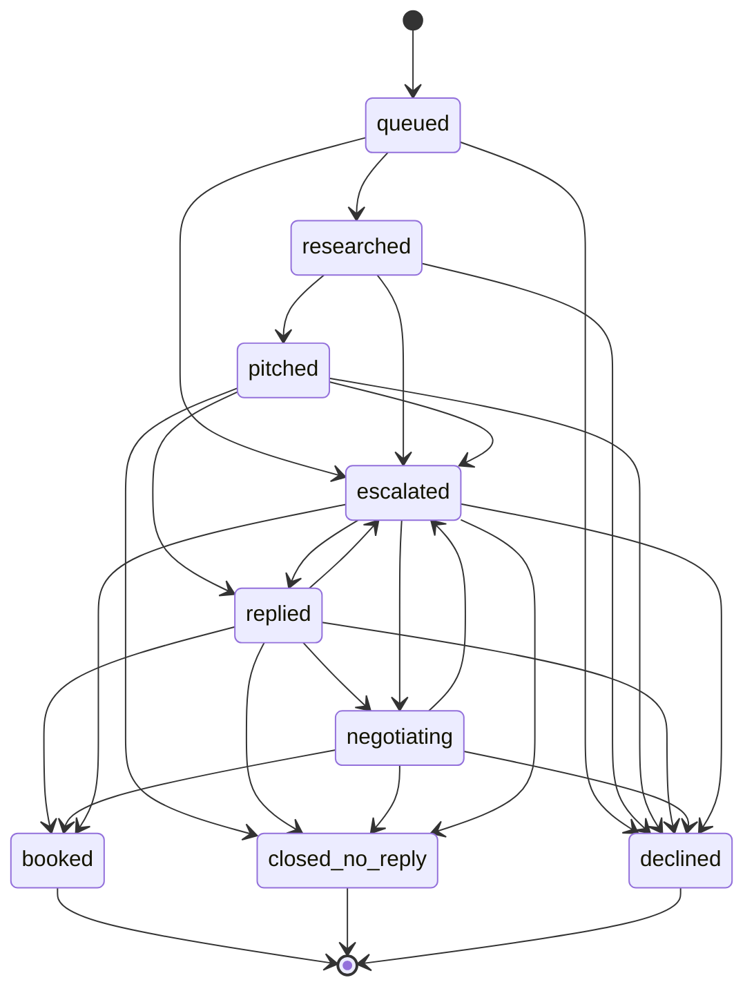

# Greenroom

**An autonomous booking-and-partnership agent for small event brands.**

Greenroom researches a target venue, writes and sends a personalised pitch, reads the
reply thread, negotiates inside a policy envelope its owner defines, books the call into
a calendar, and escalates to a human only when a decision falls outside policy. It earns
autonomy over time: every target starts in `review` and graduates to `veto` then
`autopilot` as its drafts survive human scrutiny unedited.

First customer: **Beat ID Ltd**, pitching its real pipeline of UK students' unions.

> Google *All Things Agentic* Hackathon — Track: **Taskmaster**.

---

## ⚠️ Housekeeping — do this before submission

- [ ] **Grant read access to the repo for judging:** `testing@devpost.com` and
      `cloudhackathons@google.com`
      (`gh api -X PUT repos/xavierjohncharles/greenroom/collaborators/<user> -f permission=pull`,
      or Settings → Collaborators in the GitHub UI).
- [ ] Confirm the Cloud Run URL in the demo video is visibly a `*.run.app` domain.
- [ ] Check `BUILDLOG.md` reads cleanly — it becomes the blog post and the
      "learnings" section below.

---

## Status

🚧 Under construction — 48-hour build. See `BUILDLOG.md` for the running log.

**Live on Cloud Run:** https://greenroom-29925954133.europe-west2.run.app

| Endpoint | Proves |
|---|---|
| [`/health`](https://greenroom-29925954133.europe-west2.run.app/health) | Container up, config validated, model constant |
| [`/readyz`](https://greenroom-29925954133.europe-west2.run.app/readyz) | Firestore reachable from the service |
| [`/hello`](https://greenroom-29925954133.europe-west2.run.app/hello) | ADK → Gemini 3.5 Flash on Vertex AI |
| `/` | The dashboard — pipeline board, drafts, quarantine, settings (behind the demo gate) |

## Agents

| Agent | Tools it holds | Tools it does *not* hold |
|---|---|---|
| **Researcher** | Google Search grounding, URL context | anything that sends, books, or writes state |
| **Writer** | *none* | everything |
| **Gatekeeper** (step 5) | none — screens inbound before any other agent sees it | everything |
| **Negotiator** (step 5) | read policy, read thread, draft, propose slots | send. It emits a job; it never delivers. |
| **Scheduler** | Gmail send, Calendar create/freebusy | reasoning — it is deterministic by design |

Tool scoping is structural. The read side is not *discouraged* from sending; it is handed
no send tool, so there is nothing for a prompt injection to reach for.

The Scheduler is deliberately not an `LlmAgent`. It decides whether the clock says 09:00
and whether a counter is under 25 — a language model there would add latency, cost and
non-determinism to the one component whose entire job is predictability.

## Google Cloud footprint

| Thing | Value |
|---|---|
| Project | `beatid-greenroom` (number `29925954133`) |
| Region | `europe-west2` (London) |
| Firestore | Native mode, `europe-west2` |
| Runtime identity | `greenroom-run@beatid-greenroom.iam.gserviceaccount.com` |
| Roles | `datastore.user`, `secretmanager.secretAccessor`, `aiplatform.user`, `cloudtrace.agent`, `logging.logWriter`, `storage.objectAdmin` |

The service runs as a dedicated least-privilege service account, not the default compute
identity, and holds no credential of its own — Gemini and Firestore go through ADC, and
the Gmail/Calendar refresh token is fetched from Secret Manager at call time.

## Mandatory stack (verified against live docs, 29 Aug 2026)

| Component | Choice | Notes |
|---|---|---|
| Model | `gemini-3.5-flash` via **Vertex AI** | Same model ID on Gemini API and Vertex. Vertex chosen so there is no API key to store — auth is ADC on Cloud Run. |
| Agent framework | **Google ADK** `2.8.0` (Python) | Current release, 26 Aug 2026. ADK 2.x is a breaking rewrite of 1.x (graph Workflow Runtime). |
| Runtime | **Cloud Run** | Agent + dashboard in one service. We own the FastAPI app and drive agents through `google.adk.runners.Runner`; see BUILDLOG for why not `adk deploy cloud_run`. |
| State | **Firestore** (Native mode) | |
| Inbound | **Gmail watch → Pub/Sub → push → `/inbound`** | Watch scoped to the `greenroom` label, never INBOX. |
| Ticks | **Cloud Scheduler** | Hourly tick + an 08:00 Europe/London morning brief. |
| Secrets | **Secret Manager** | OAuth refresh token lives here and nowhere else. |
| Tracing | **Cloud Trace** via OpenTelemetry | One trace per inbound/tick, one span per agent and per tool call. |
| Images | `gemini-3-pro-image` on Vertex AI | **Imagen is retired** — see below. |
| Language | **Python 3.12** | |

## OAuth scopes requested

Narrowest set that satisfies the mailbox rules:

| Scope | Why it is needed |
|---|---|
| `https://www.googleapis.com/auth/gmail.send` | Send pitches and replies. |
| `https://www.googleapis.com/auth/gmail.modify` | Required to *apply* the `greenroom` labels, to read the agent's own threads, and to register `users.watch`. `gmail.labels` only manages label definitions and cannot attach them to a thread, so `readonly` + `labels` is not sufficient. `gmail.modify` cannot delete mail. |
| `https://www.googleapis.com/auth/calendar.events` | Create the booked call on the primary calendar. |
| `https://www.googleapis.com/auth/calendar.freebusy` | Propose slots without granting read access to event contents. |

`gmail.modify` is broader than Greenroom's own rules allow. **The rules are enforced in
code, not by the scope.** See "Mailbox containment" below.

## Mailbox containment

`admin@beatidapp.com` is a live shared company inbox. Greenroom is constrained so that
it can only ever touch its own footprint:

- **Sending** is refused unless the recipient address appears in `config/targets.csv`.
- **Reading** is only possible via a thread ID Greenroom itself recorded in Firestore,
  or a `label:greenroom` query. There is no code path that fetches an arbitrary message.
- The Gmail tool wrapper exposes **no** archive, delete, trash, or untrash method at all.
- Labels are only ever *added*, and only to threads Greenroom created.
- `users.watch` is scoped to the `greenroom` label, not `INBOX`.
- Calendar: create-only. The wrapper has no patch or delete method.

## Quick start

Full spin-up-from-a-clean-project instructions land at step 9. For now:

```bash
make setup      # Python 3.12 venv + dependencies
make test       # pytest
make run-local  # dashboard + agent on :8080, dry-run (logs sends, never sends)
make deploy     # Cloud Run via Cloud Build
```

## Pipeline state machine

Every status change goes through `assert_transition`. That is not tidiness: it means an
agent talked into something strange by a hostile email cannot move a target somewhere
the pipeline does not allow. `escalated` is reachable from every live status, because
"ask a human" must never be blocked by bookkeeping.

This diagram is generated from the transition table in `state/machine.py` by
`make diagram`, so it cannot drift from the code.

<!-- STATE-DIAGRAM:START -->



<!-- STATE-DIAGRAM:END -->

## Inbound: how a reply is handled

```
Gmail watch (label: greenroom, never INBOX)
   → Pub/Sub topic → push subscription (OIDC-signed)
   → POST /inbound  — verifies issuer, audience and service-account email
   → dedupe on Gmail message id (Pub/Sub is at-least-once)
   → ownership check: is this a thread Greenroom created?
   → Gatekeeper  ── injection? ──→ quarantine, label, escalate, STOP
   → Negotiator (structured verdict only, never the raw email)
   → policy.evaluate  ── outside? ──→ escalation draft citing the rule
   → draft: review | veto (30 min) | autopilot
   → job → Scheduler → send (recipient re-checked against targets.csv)
```

The Gatekeeper runs before anything else sees a message, and if it quarantines, the
pipeline stops — the Negotiator is never invoked, so attacker-controlled text never
reaches an agent that drafts replies. What crosses that boundary is a typed verdict:
an intent enum, a neutral third-person summary, at most three quotes capped at 200
characters, and extracted terms as numbers and booleans.

**A model never decides whether a deal is acceptable.** It extracts what was asked for;
`greenroom/policy.py` decides, deterministically, against `config/policy.yaml`. So an
email cannot talk the agent into a bad deal — the agent is not the thing doing the
accepting. Every breach carries its rule id and configured value, which is why the
dashboard cites `fee.floor = 850` rather than a paraphrase.

### Injection screening

Two independent detectors, combined with OR — either one firing quarantines:

| Layer | Catches | Cannot |
|---|---|---|
| Deterministic regex | 4 of the 5 test attacks, instantly and for free | anticipate a novel phrasing |
| Gemini 3.5 Flash | all 5, including the subtly embedded one | be relied on alone against text written to fool a model |

Measured on the 15-email fixture set in `tests/fixtures/inbound_emails.py`
(5 attacks, 10 genuine): **regex 4/5, model 15/15, zero false positives on genuine mail.**

## Posters — and a note on Imagen

Greenroom generates a 1080×1350 poster per target and attaches it to the pitch. Prompt
lives in `config/poster_prompt.py` and nowhere else, so it can be tuned without touching
any other file.

**The hackathon bonus names Imagen. Imagen no longer exists.** Verified against this
project on 30 Aug 2026: every `imagen-*` endpoint returns `404 NOT_FOUND` in every region
tested. Google's deprecation notice gave a migration date of 2026-06-30 and the endpoints
are now actually switched off, not merely discouraged — the notice points at the Gemini
image family as the successor, which is what we use.

```
global       gemini-3-pro-image       OK  1,986,090 bytes
global       gemini-3.1-flash-image   OK  1,317,180 bytes
global       gemini-2.5-flash-image   OK    819,090 bytes
*            imagen-4.0-generate-001  404 NOT_FOUND   (all regions)
```

Two things worth recording for anyone reproducing this:

* **Image models serve from the `global` endpoint only.** `europe-west2`, where the rest
  of Greenroom runs, has none — so `tools/images.py` builds its own client rather than
  sharing the regional one.
* **No model offers 4:5.** The poster is generated at 3:4 and centre-cropped, which is
  why the prompt insists on clear space below the last line of text.

## The tick

Cloud Scheduler drives everything periodic. Two jobs, both authenticated with an OIDC
token that `/tick` verifies — the endpoint runs agents and can cause mail to be sent, so
it is not open to anyone holding the URL.

| Job | Schedule | Does |
|---|---|---|
| `greenroom-tick` | hourly, Europe/London | run due jobs, reconcile inbound, expire veto windows, close stale threads, renew the Gmail watch |
| `greenroom-morning-brief` | 08:00 Europe/London | the same tick, which also writes the brief and regenerates the style memo |

Each step is isolated: if the brief fails, the follow-ups still go out, and the failure
appears in the response and in Cloud Trace rather than being silently skipped.

The brief is written **once per day**, checked against the stored brief rather than the
clock — so an hourly tick produces one brief a day, and a tick that fails at 08:00 still
produces one at 09:00 instead of skipping the day.

## The trust dial

| Mode | What happens to a draft |
|---|---|
| `review` | Nothing sends. It waits on the dashboard. Every target starts here. |
| `veto` | A send job is queued for 30 minutes' time. Silence becomes consent. |
| `autopilot` | Queued immediately. |

Three consecutive approvals **with no edits** promote one level; any edit demotes one
level immediately. Trust is slow to gain and fast to lose.

Two rules override the mode entirely:

* **An escalation is always `review`**, whatever autonomy a target has earned. Earned
  autonomy is permission to skip review on ordinary replies, never permission to decide
  outside the policy envelope.
* **A draft that breaks a copy rule is always `review`**, for the same reason.

The dial measures whether the human *changed the text*, not which button they pressed —
pressing "Save edit & send" on an untouched draft is an approval.

### The style memo

Regenerated from the diffs between what the Writer produced and what the human actually
sent. Approvals carry no signal — they only say "this was fine" — so the memo is built
from edits alone. It is a fixed-size summary that gets rewritten rather than an
accumulating list of diffs, so twenty edits and two hundred produce a prompt of the same
length. Below two real edits it produces nothing at all, and the Writer falls back to the
brand tone notes: a confident wrong memo is worse than an empty one, because the Writer
will follow it.

## Durability

Every side effect — an email, a calendar booking, a poster — is a job document with an
idempotency key, an attempt count and a worker lease.

| Property | How | Proven by |
|---|---|---|
| No double sends | Document id is derived from the idempotency key, so a redelivered Pub/Sub notification is a no-op | `test_enqueueing_the_same_key_twice_creates_one_job` |
| No two workers on one job | Claiming is a Firestore transaction stamping a worker id and lease | `test_a_job_can_only_be_claimed_once` |
| Crashes self-heal | A dead worker's lease lapses and the job returns to the queue unaided | `test_a_crashed_worker_releases_its_job` |
| Repeated failure surfaces | Backoff, then `dead` for a human rather than a silent retry loop | `test_failure_backs_off_then_dies_for_a_human` |
| Caps hold under concurrency | The daily slot is reserved in a transaction *before* the send, and released if it fails | `test_the_daily_cap_is_enforced_atomically` |

## Architecture

Full diagram lands at step 9 (Mermaid + exported PNG).

## Learnings

See `BUILDLOG.md`.
